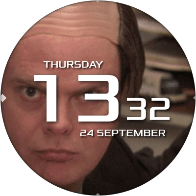

# Dwight Disguise

A stupid but funny wallpaper which surprises you anytime you wake the screen. Only for [AsteroidOS](http://asteroidos.org/)



## How to install

Firstly you'll need to clone this repository:
```bash
git clone https://github.com/MagneFire/dwight-disguise.git
cd dwight-disguise
```
Then depending on the USB mode of your watch you can either chose to install using SSH/SCP or ADB mode.

To install using SSH/SCP mode use the command:
```bash
./push.sh
```

To install using ADB mode use the command:
```bash
./push.sh adb
```

## Credits

Original idea is taken from: https://www.reddit.com/r/DunderMifflin/comments/bqpnqc/thought_yall_would_like_my_apple_watch_face_i/
